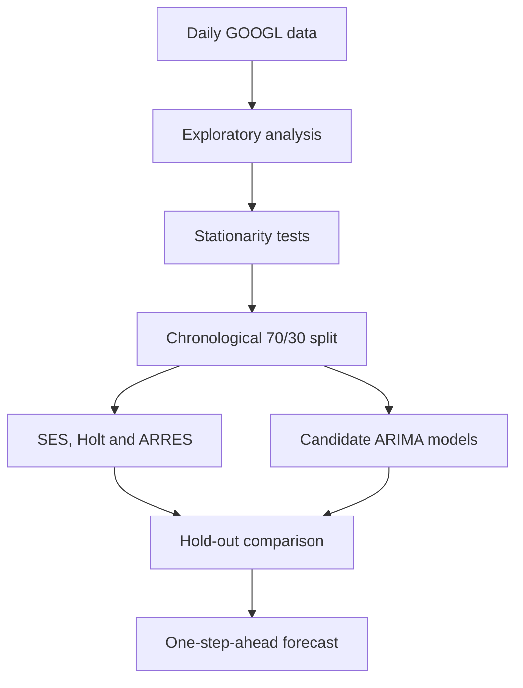

# Google Stock Price Forecasting with Time-Series Models


This academic time-series project analyzes and forecasts the daily closing price of Alphabet Inc. Class A stock (GOOGL). It compares exponential-smoothing techniques with Box-Jenkins ARIMA models using a chronological 70/30 estimation and hold-out design.

The analysis covers 2,775 trading-day observations from 2 January 2013 to 10 January 2024. The final model choice is based on forecasting accuracy, residual diagnostics, simplicity, and parsimony.

> This project is an educational forecasting study, not financial advice. Forecasts based on historical prices are uncertain and should not be treated as guaranteed future values.

## Research objectives

- Examine the trend, cyclical behavior, seasonality, and irregular movement of Google daily closing prices.
- Compare univariate smoothing and ARIMA forecasting approaches.
- Select an appropriate model and produce an evidence-based one-step-ahead forecast.

## Dataset

| Item | Value |
| --- | --- |
| Security | Alphabet Inc. Class A (GOOGL) |
| Frequency | Daily trading observations |
| Date range | 2 January 2013 - 10 January 2024 |
| Observations | 2,775 |
| Variables | Date, Open, High, Low, Close, Volume |
| Missing values | None |
| Duplicate rows | None |
| Estimation sample | 1,942 observations (70%) |
| Hold-out sample | 833 observations (30%) |

## Analysis workflow



## Models evaluated

### Univariate smoothing

- Single Exponential Smoothing (SES)
- Holt's Method
- Adaptive Response Rate Exponential Smoothing (ARRES)

### ARIMA candidates

- ARIMA(1,1,0)
- ARIMA(0,1,1)
- ARIMA(1,1,1)
- ARIMA(2,1,2)
- Auto ARIMA(3,1,2)

## Key findings

### Stationarity

The level series showed a strong upward trend and a slowly decaying autocorrelation function. Although the level ADF and PP tests rejected a unit root, the KPSS test strongly rejected stationarity. First-order differencing removed the trend, after which ADF, PP, and KPSS agreed that the transformed series was stationary. Therefore, the ARIMA models used `d = 1`.

### Univariate hold-out performance

| Model | Hold-out MSE | Hold-out MAPE | One-step forecast |
| --- | ---: | ---: | ---: |
| SES | 5.1038 | 1.4536% | USD 143.62 |
| **Holt's Method** | **5.0963** | **1.4497%** | **USD 143.67** |
| ARRES | 7.4382 | 1.7953% | USD 141.37 |

Holt's Method achieved the lowest hold-out error. Its high level-smoothing parameter (`alpha = 0.8787`) placed substantial weight on the most recent closing price, which matched the near-random-walk behavior observed in the series.

### ARIMA findings

Auto ARIMA selected ARIMA(3,1,2), which recorded the lowest information criteria among the five ARIMA candidates:

| Metric | ARIMA(3,1,2) |
| --- | ---: |
| AIC | 4483.72 |
| AICc | 4483.76 |
| BIC | 4517.14 |
| Approximate hold-out MSE | 5.1984 |
| Hold-out MAPE | 1.4700% |
| One-step forecast | USD 143.85 |

All tested ARIMA candidates failed the Ljung-Box residual white-noise test at 44 lags. ARIMA(3,1,2) had the strongest diagnostic result among them, but its remaining residual autocorrelation is an important limitation.

### Final selection

Holt's Method was selected as the final forecasting model because it provided the best combination of hold-out accuracy, simplicity, and parsimony. Its one-step-ahead forecast was **USD 143.67**, compared with the latest observed close of USD 143.80.

## Repository structure

```text
.
├── data/
│   └── GoogleStock_Dataset.csv
├── docs/
│   └── model-comparison.png
├── report/
│   └── STA GROUP ASSIGMENT 3.pdf
├── scripts/
│   ├── Arima_Model_Google.R
│   └── Univariate_model_google.R
├── .gitignore
└── README.md
```

## Reproduce the analysis

### Requirements

- R 4.x
- RStudio (optional)
- R packages: `fpp2`, `forecast`, `tseries`, `fable`, `tsibble`, and `dplyr`

Install the packages once:

```r
install.packages(c("fpp2", "forecast", "tseries", "fable", "tsibble", "dplyr"))
```

Run the scripts from the repository root so that the relative dataset path resolves correctly:

```bash
Rscript scripts/Univariate_model_google.R
Rscript scripts/Arima_Model_Google.R
```

The scripts print model summaries and accuracy measures to the console and generate diagnostic and forecast plots in the active R graphics device. The exhaustive `auto.arima()` search may take additional time.

## Full report

[Read the complete STA572 assignment report](report/STA%20GROUP%20ASSIGMENT%203.pdf).

## Project team

- Muhammad Syakirin bin Shamsunrizan
- Muhammad Nurhilman bin Mohd Rozalee
- Harith Ikhwan bin Suhaimi
- Muhammad Kamil Aqili bin Abdul Rahman
- Muhammad Aliff bin Ab Rahim

Course: STA572 - Time Series Analysis and Forecasting, Universiti Teknologi MARA (UiTM), March-July 2026.
