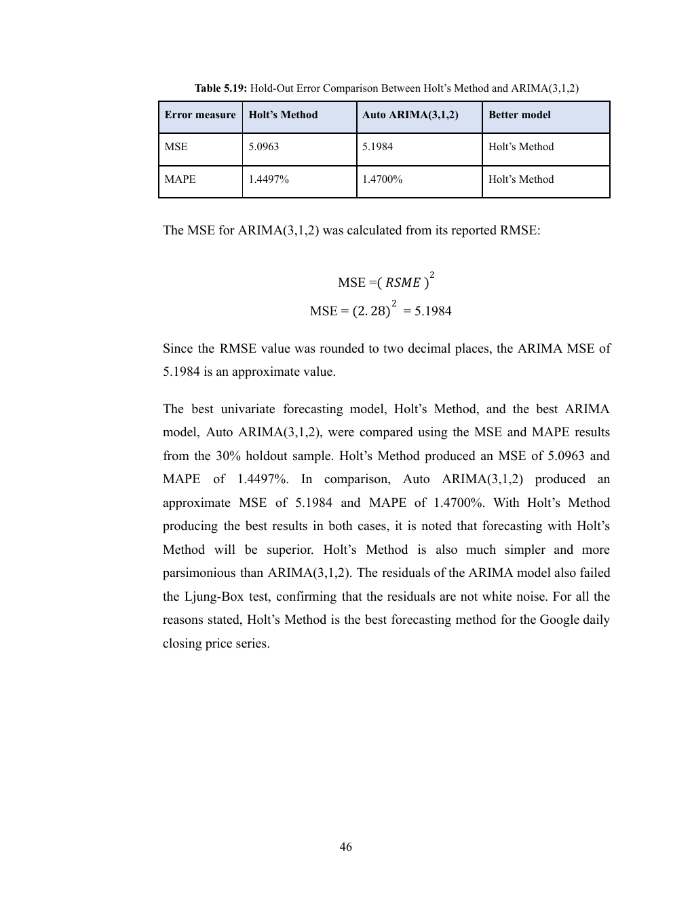
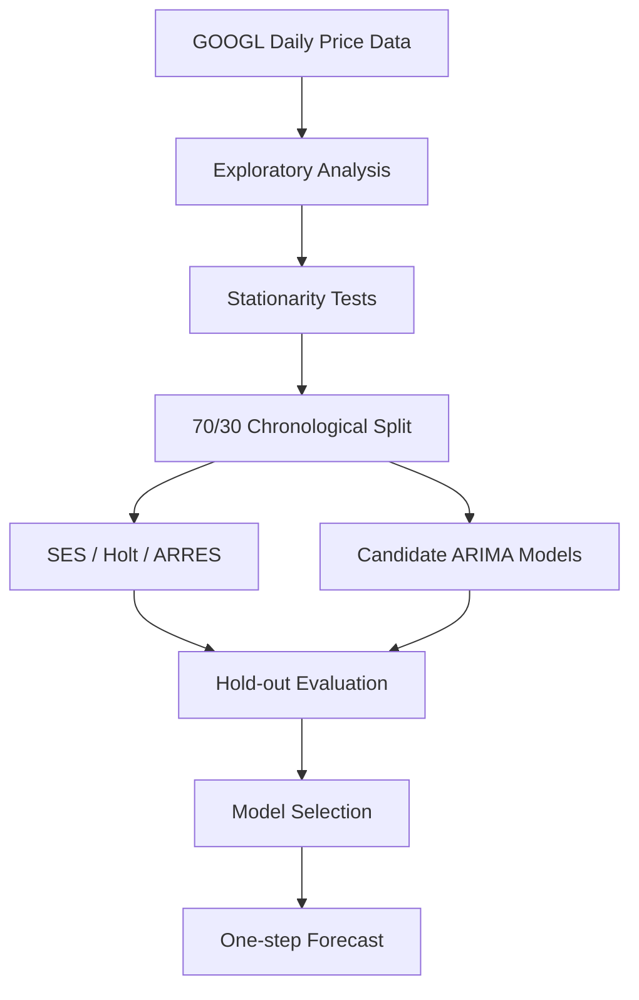

# Google Stock Price Forecasting with Time-Series Models

A time-series forecasting project using **R** to analyse and forecast Alphabet Inc. Class A (GOOGL) daily closing prices with smoothing methods and ARIMA models.



## At a Glance

| Area | Details |
|---|---|
| Project Type | Time-Series Analysis / Forecasting |
| Language | R |
| Dataset | Alphabet Inc. Class A daily stock data |
| Observations | 2,775 trading days |
| Date Range | 2 Jan 2013 – 10 Jan 2024 |
| Validation | Chronological 70/30 estimation and hold-out split |
| Best Final Model | Holt's Method |
| Hold-out MAPE | **~1.45%** |

> Educational forecasting study only. This project is not financial advice.

## Objective

The project compares classical time-series forecasting approaches to determine which model provides the best balance of accuracy, simplicity and residual behaviour for one-step-ahead prediction.

The analysis covers:

- trend and time-series behaviour;
- stationarity testing;
- chronological hold-out evaluation;
- exponential-smoothing methods;
- ARIMA model comparison;
- residual diagnostics; and
- one-step-ahead forecasting.

## Workflow



## Models Evaluated

### Exponential Smoothing

- Single Exponential Smoothing (SES)
- Holt's Method
- Adaptive Response Rate Exponential Smoothing (ARRES)

### ARIMA Candidates

- ARIMA(1,1,0)
- ARIMA(0,1,1)
- ARIMA(1,1,1)
- ARIMA(2,1,2)
- Auto ARIMA(3,1,2)

## Key Results

| Model | Hold-out MSE | Hold-out MAPE | One-step Forecast |
|---|---:|---:|---:|
| SES | 5.1038 | 1.4536% | USD 143.62 |
| **Holt's Method** | **5.0963** | **1.4497%** | **USD 143.67** |
| ARRES | 7.4382 | 1.7953% | USD 141.37 |

Holt's Method produced the lowest hold-out error and was selected as the final forecasting model.

Auto ARIMA selected **ARIMA(3,1,2)** with the lowest information criteria among the tested ARIMA candidates. However, residual diagnostics showed remaining autocorrelation, so Holt's Method provided a better final balance of forecasting accuracy, simplicity and parsimony.

## Stationarity & Diagnostics

The original series displayed strong trend behaviour. First-order differencing was used before fitting ARIMA models, after which the transformed series showed improved stationarity behaviour.

Residual diagnostics, including Ljung-Box testing, were used to evaluate whether model residuals behaved like white noise.

## Repository Structure

```text
.
├── data/
│   └── GoogleStock_Dataset.csv
├── docs/
│   └── model-comparison.png
├── report/
│   └── STA GROUP ASSIGMENT 3.pdf
├── scripts/
│   ├── Arima_Model_Google.R
│   └── Univariate_model_google.R
├── .gitignore
└── README.md
```

## Reproduce the Analysis

Install the required R packages:

```r
install.packages(c("fpp2", "forecast", "tseries", "fable", "tsibble", "dplyr"))
```

Run the scripts:

```bash
Rscript scripts/Univariate_model_google.R
Rscript scripts/Arima_Model_Google.R
```

## Skills Demonstrated

- R programming
- Time-series analysis
- Forecasting
- Stationarity testing
- ARIMA modelling
- Exponential smoothing
- Hold-out validation
- Residual diagnostics
- Model comparison and selection

## Full Report

See the complete academic report in:

`report/STA GROUP ASSIGMENT 3.pdf`

## Project Team

- Muhammad Syakirin bin Shamsunrizan
- Muhammad Nurhilman bin Mohd Rozalee
- Harith Ikhwan bin Suhaimi
- Muhammad Kamil Aqili bin Abdul Rahman
- Muhammad Aliff bin Ab Rahim

Course: STA572 – Time Series Analysis and Forecasting, Universiti Teknologi MARA (UiTM)
